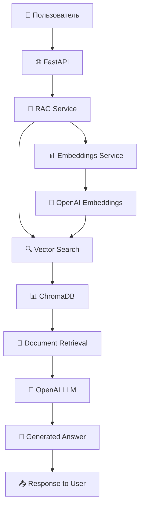

# 🔍 RAG Knowledge Base

[](https://python.org)
[](https://fastapi.tiangolo.com)
[](https://www.trychroma.com)
[](https://openai.com)
[](https://docker.com)

**Интеллектуальная система поиска по базе знаний** с использованием RAG (Retrieval-Augmented Generation), векторных эмбеддингов и языковых моделей для генерации точных ответов на основе корпоративных документов.

## 🎯 Основные возможности

### 🧠 **Умный семантический поиск**
- **Векторный поиск**: находит релевантную информацию даже при неточных запросах
- **Контекстно-зависимые ответы**: генерирует ответы на основе документов компании
- **Настраиваемая релевантность**: гибкие пороги для точности поиска

### ⚡ **Высокая производительность**
- **Асинхронная архитектура** на базе FastAPI
- **Автоматическая индексация** документов при запуске
- **Оптимизация токенов** с обрезкой длинных текстов
- **Векторная база данных** ChromaDB для быстрого поиска

### 🏗️ **Production-ready архитектура**
- **Типизированный код** с полной поддержкой mypy
- **Структурированное логирование** с детальными сообщениями
- **Обработка ошибок** с кастомными исключениями
- **Docker контейнеризация** для простого развертывания
- **Health checks** для мониторинга состояния системы

## 📚 Архитектура проекта

```
app/
├── 🎯 api/v1/              # REST API эндпоинты
│   ├── search.py          # Поиск и Q&A функционал
│   ├── health.py          # Проверка здоровья сервиса
│   └── router.py          # Роутинг API
├── 🧠 core/               # Основная бизнес-логика
│   ├── client.py          # OpenAI API клиент
│   ├── config.py          # Конфигурация приложения
│   ├── exceptions.py      # Кастомные исключения
│   ├── prompts.py         # Шаблоны промптов
│   └── schemas.py         # Pydantic модели
├── 💾 data/               # Обработка данных
│   ├── loader.py          # Загрузка документов
│   └── preprocessor.py    # Предобработка текста
├── 📁 documents/          # Корпоративные документы
│   ├── company_handbook.txt
│   ├── hr_policies.txt
│   ├── product_docs.txt
│   └── technical_specs.txt
└── 🔧 services/           # Сервисный слой
    ├── embeddings.py      # Работа с эмбеддингами
    ├── rag_service.py     # RAG оркестратор
    ├── retriever.py       # Поиск документов
    └── vector_store.py    # Векторная база данных
```

### 🔄 Поток обработки запроса



## 🛠️ Технологический стек

- **FastAPI** - современный веб-фреймворк для API
- **ChromaDB** - векторная база данных для семантического поиска
- **LangChain** - фреймворк для работы с LLM
- **OpenAI** - эмбеддинги и языковые модели
- **Pydantic** - валидация данных и сериализация
- **Docker** - контейнеризация и развертывание

## 🚀 Быстрый старт

### Требования

- **Python 3.11+**
- **Poetry** для управления зависимостями
- **OpenAI API ключ**

### Установка

1. **Клонирование проекта:**
```bash
git clone https://github.com/softkisik228/RAG-Knowledge-Base.git
cd rag-knowledge-base
```

2. **Установка зависимостей:**
```bash
poetry install
```

3. **Настройка окружения:**
```bash
cp .env.example .env
```

Отредактируйте `.env` файл:
```bash
# Обязательные настройки
OPENAI_API_KEY=sk-ваш-ключ-openai

# Опциональные настройки
EMBEDDING_MODEL=text-embedding-3-small
LLM_MODEL=gpt-3.5-turbo
CHUNK_SIZE=1000
CHUNK_OVERLAP=200
SIMILARITY_THRESHOLD=0.7
```

4. **Подготовка документов:**

Поместите ваши документы в директорию `app/documents/`. Поддерживаемые форматы: `.txt`, `.md`.

5. **Запуск сервера разработки:**
```bash
# Использует переменные из .env файла
poetry run uvicorn app.main:app --reload

# Или с явным указанием хоста и порта
poetry run uvicorn app.main:app --reload --host 0.0.0.0 --port 8000
```

6. **Открыть документацию API:**
```
# Swagger UI
http://localhost:8000/docs

# ReDoc
http://localhost:8000/redoc
```

### 🐳 Запуск с Docker

```bash
# Сборка и запуск
docker-compose up --build

# Просмотр логов
docker-compose logs -f
```

Приложение будет доступно по адресу: http://localhost:8000

## � Примеры использования API

### 1. 🤖 Задать вопрос базе знаний

**Запрос:**
```bash
curl -X POST "http://localhost:8000/api/v1/search/query" \
  -H "Content-Type: application/json" \
  -d '{
    "question": "Какой у нас график работы?",
    "max_docs": 3,
    "threshold": 0.7
  }'
```

**Ответ:**
```json
{
  "answer": "Согласно корпоративному справочнику, рабочий график компании: понедельник-пятница с 9:00 до 18:00, обеденный перерыв с 13:00 до 14:00. В пятницу рабочий день сокращен до 17:00.",
  "sources": [
    {
      "content": "Рабочее время: понедельник-пятница 9:00-18:00...",
      "metadata": {
        "source": "company_handbook.txt",
        "chunk_id": "chunk_42"
      },
      "similarity_score": 0.89
    }
  ],
  "processing_time": 1.23,
  "tokens_used": 245
}
```

### 2. 🔍 Семантический поиск документов

**Запрос:**
```bash
curl -X POST "http://localhost:8000/api/v1/search/similar" \
  -H "Content-Type: application/json" \
  -d '{
    "question": "компенсации сотрудникам",
    "max_docs": 5,
    "threshold": 0.6
  }'
```

**Ответ:**
```json
{
  "documents": [
    {
      "content": "Компенсационные выплаты включают в себя: оплата мобильной связи до 2000 руб/мес, компенсация проезда, обеды в офисе...",
      "metadata": {
        "source": "hr_policies.txt",
        "chunk_id": "chunk_15",
        "document_type": "policy"
      },
      "similarity_score": 0.92
    },
    {
      "content": "Дополнительные льготы: медицинская страховка, абонемент в спортзал, корпоративные скидки...",
      "metadata": {
        "source": "hr_policies.txt", 
        "chunk_id": "chunk_16"
      },
      "similarity_score": 0.87
    }
  ],
  "total_found": 2,
  "processing_time": 0.45
}
```

### 3. � Переиндексация документов

**Запрос:**
```bash
curl -X POST "http://localhost:8000/api/v1/search/reload" \
  -H "Content-Type: application/json"
```

**Ответ:**
```json
{
  "message": "База знаний успешно переиндексирована",
  "documents_processed": 4,
  "chunks_created": 127,
  "processing_time": 8.45
}
```

### 4. 📊 Статистика системы

**Запрос:**
```bash
curl -X GET "http://localhost:8000/api/v1/search/stats"
```

**Ответ:**
```json
{
  "total_documents": 4,
  "total_chunks": 127,
  "vector_store_size": "1.2MB",
  "last_update": "2024-01-15T10:30:00Z",
  "embedding_model": "text-embedding-3-small",
  "collection_name": "company_knowledge"
}
```

### 5. 🏥 Проверка состояния системы

**Запрос:**
```bash
curl -X GET "http://localhost:8000/api/v1/health"
```

**Ответ:**
```json
{
  "status": "healthy",
  "timestamp": "2024-01-15T10:35:22Z",
  "version": "1.0.0",
  "components": {
    "vector_store": "healthy",
    "openai_api": "healthy", 
    "documents": "loaded"
  }
}
```

### 6. 🔍 Детальная диагностика

**Запрос:**
```bash
curl -X GET "http://localhost:8000/api/v1/health/detailed"
```

**Ответ:**
```json
{
  "status": "healthy",
  "timestamp": "2024-01-15T10:35:22Z",
  "uptime": "2h 15m 33s",
  "memory_usage": "245MB",
  "vector_store": {
    "status": "healthy",
    "collection_count": 1,
    "total_vectors": 127,
    "last_query": "2024-01-15T10:34:45Z"
  },
  "openai_api": {
    "status": "healthy",
    "response_time": "890ms",
    "last_request": "2024-01-15T10:35:12Z"
  },
  "documents": {
    "status": "loaded",
    "count": 4,
    "last_indexed": "2024-01-15T08:20:15Z"
  }
}
```

## 🎛️ Конфигурация

### Основные настройки

| Параметр | Описание | По умолчанию |
|----------|----------|--------------|
| `OPENAI_API_KEY` | API ключ OpenAI (обязательно) | - |
| `EMBEDDING_MODEL` | Модель для эмбеддингов | `text-embedding-3-small` |
| `EMBEDDING_DIMENSION` | Размерность векторов | `1536` |
| `LLM_MODEL` | Языковая модель для ответов | `gpt-3.5-turbo` |
| `LLM_TEMPERATURE` | Температура генерации (0.0-2.0) | `0.7` |
| `LLM_MAX_TOKENS` | Максимум токенов в ответе | `1000` |
| `CHUNK_SIZE` | Размер фрагмента текста | `1000` |
| `CHUNK_OVERLAP` | Перекрытие фрагментов | `200` |
| `SIMILARITY_THRESHOLD` | Порог релевантности | `0.7` |
| `MAX_RETRIEVED_DOCS` | Макс. документов для ответа | `5` |
| `CHROMA_PERSIST_DIRECTORY` | Путь к векторной БД | `./data/chroma_db` |
| `COLLECTION_NAME` | Имя коллекции | `company_knowledge` |
| `DOCUMENTS_PATH` | Путь к документам | `./app/documents` |

### Конфигурация векторного поиска

#### 🎯 **Настройки релевантности**
- **SIMILARITY_THRESHOLD** (0.0-1.0): Минимальный порог схожести для включения документа в результат
  - `0.9+` - очень высокая релевантность (только точные совпадения)
  - `0.7-0.8` - высокая релевантность (рекомендуемое значение)
  - `0.5-0.6` - средняя релевантность (более широкий поиск)
  - `<0.5` - низкая релевантность (может включать нерелевантные результаты)

#### 📝 **Обработка текста**
- **CHUNK_SIZE**: Размер фрагментов при разбиении длинных документов
- **CHUNK_OVERLAP**: Количество символов перекрытия между соседними фрагментами
- **MAX_RETRIEVED_DOCS**: Максимальное количество документов для генерации ответа

### Типы документов и их обработка

#### 📄 **Поддерживаемые форматы**
- **`.txt`** - обычные текстовые файлы
- **`.md`** - Markdown документы

#### 🏷️ **Автоматические метаданные**
- **source**: имя исходного файла
- **chunk_id**: уникальный идентификатор фрагмента
- **file_size**: размер файла в байтах
- **created_date**: дата создания файла
- **modified_date**: дата последнего изменения

## 📊 Мониторинг и метрики

### Доступные метрики

- **Векторная БД**: Количество документов, размер коллекции, время последнего обновления
- **Производительность**: Время обработки запросов, использование токенов
- **Качество**: Средний скор релевантности, количество найденных документов
- **API**: Статус OpenAI API, время отклика

### Health Check эндпоинты

```bash
# Базовая проверка
curl http://localhost:8000/api/v1/health

# Детальная проверка
curl http://localhost:8000/api/v1/health/detailed

# Готовность к работе
curl http://localhost:8000/api/v1/readiness

# Проверка жизнеспособности
curl http://localhost:8000/api/v1/liveness
```

### Коды состояний

| Статус | Описание |
|--------|----------|
| `healthy` | Все компоненты работают нормально |
| `degraded` | Некоторые компоненты работают с ограничениями |
| `unhealthy` | Критические ошибки в работе системы |

## 🛠️ Разработка

### Команды для разработки

```bash
# Установка зависимостей
poetry install

# Установка dev зависимостей
poetry install --with dev

# Проверка типов
poetry run mypy .

# Форматирование кода
poetry run black .
poetry run isort .

# Линтинг
poetry run ruff check .

# Исправление линтинга
poetry run ruff check . --fix

# Запуск локально
poetry run python -m app.main
```

### Структура конфигурации

```bash
# Файлы конфигурации
pyproject.toml          # Poetry зависимости и настройки инструментов
.env.example           # Шаблон переменных окружения
docker-compose.yml     # Docker композиция для разработки
Dockerfile            # Образ для контейнеризации
.gitignore            # Исключения для Git
```

### Инструменты разработки

- **Black**: Автоматическое форматирование кода
- **isort**: Сортировка импортов
- **Ruff**: Быстрый линтер Python
- **MyPy**: Статическая проверка типов
- **Poetry**: Управление зависимостями

## 🐳 Docker развертывание

### Локальная разработка

```bash
# Сборка образа
docker build -t rag-knowledge-base .

# Запуск контейнера
docker run -p 8000:8000 \
  -e OPENAI_API_KEY=sk-ваш-ключ \
  -e EMBEDDING_MODEL=text-embedding-3-small \
  -e LLM_MODEL=gpt-3.5-turbo \
  -v $(pwd)/app/documents:/app/documents \
  rag-knowledge-base
```

### Production развертывание

```yaml
# docker-compose.prod.yml
version: '3.8'

services:
  rag-api:
    image: rag-knowledge-base:latest
    ports:
      - "${PORT:-8000}:8000"
    environment:
      - OPENAI_API_KEY=${OPENAI_API_KEY}
      - EMBEDDING_MODEL=${EMBEDDING_MODEL:-text-embedding-3-small}
      - LLM_MODEL=${LLM_MODEL:-gpt-3.5-turbo}
      - CHUNK_SIZE=${CHUNK_SIZE:-1000}
      - SIMILARITY_THRESHOLD=${SIMILARITY_THRESHOLD:-0.7}
      - CHROMA_PERSIST_DIRECTORY=/app/data/chroma_db
    volumes:
      - ./documents:/app/documents:ro
      - chroma_data:/app/data/chroma_db
    restart: unless-stopped
    healthcheck:
      test: ["CMD", "curl", "-f", "http://localhost:8000/api/v1/health"]
      interval: 30s
      timeout: 10s
      retries: 3
      start_period: 40s

volumes:
  chroma_data:
```

## 🔧 Производство

### Рекомендации для production

1. **Безопасность**:
   - Используйте secrets для API ключей
   - Ограничьте CORS origins конкретными доменами
   - Настройте HTTPS с валидными сертификатами
   - Добавьте rate limiting для API endpoints

2. **Масштабирование**:
   - Используйте внешнюю векторную БД (Pinecone, Weaviate)
   - Настройте автоскейлинг контейнеров
   - Кэширование частых запросов
   - Load balancer для высокой доступности

3. **Мониторинг**:
   - Логи в structured формате (JSON)
   - Метрики Prometheus/Grafana
   - Алерты на критические ошибки
   - Мониторинг использования токенов OpenAI

4. **Оптимизация**:
   - Connection pooling для ChromaDB
   - Батчинг запросов к OpenAI API
   - Настройка размеров чанков под ваши документы
   - Регулярная переиндексация документов

### Переменные окружения для production

```bash
# .env.production
OPENAI_API_KEY=sk-real-production-key
EMBEDDING_MODEL=text-embedding-3-small
LLM_MODEL=gpt-3.5-turbo
CHUNK_SIZE=1000
CHUNK_OVERLAP=200
SIMILARITY_THRESHOLD=0.75
MAX_RETRIEVED_DOCS=3
CHROMA_PERSIST_DIRECTORY=/data/chroma_db
LOG_LEVEL=INFO
CORS_ORIGINS=https://yourdomain.com,https://app.yourdomain.com
```

## 🤝 Contributing

1. Fork репозиторий
2. Создайте feature branch (`git checkout -b feature/amazing-feature`)
3. Commit изменения (`git commit -m 'Add amazing feature'`)
4. Push в branch (`git push origin feature/amazing-feature`)
5. Создайте Pull Request

### Правила разработки

- Все изменения должны быть покрыты тестами
- Код должен проходить все проверки (mypy, ruff, black)
- Документация должна быть обновлена при необходимости
- Коммиты должны следовать Conventional Commits

## 📄 License

MIT License - см. файл [LICENSE](LICENSE) для деталей.